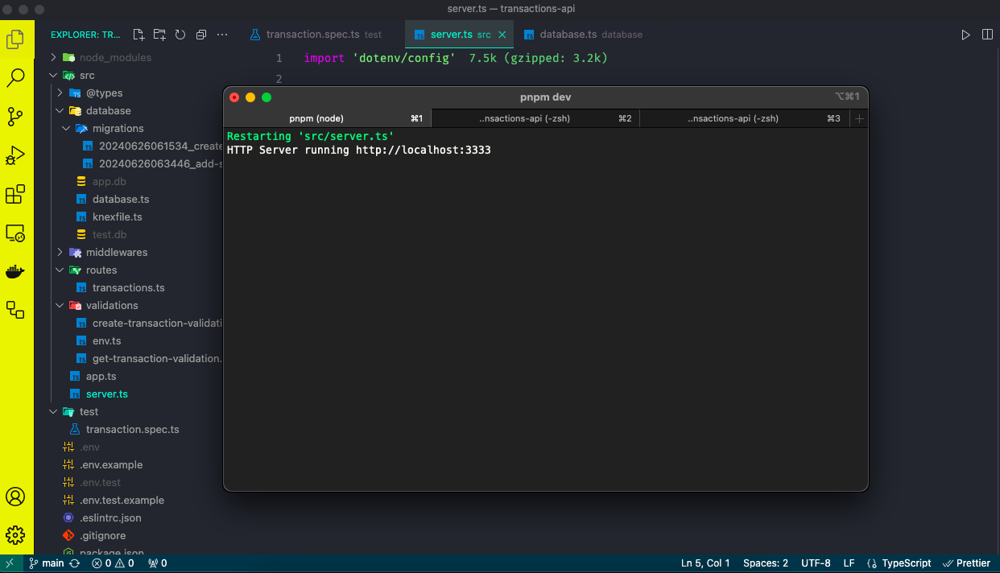

# Transactions API

Transaction is an app for controlling expenses.

## Technologies used

- Node.js
- Knex
- Tests e2e (vitest/supertest)

## HTTP

### POST `/transactions`

Create a new poll.

#### Request body

```json
{
  "title": "Teste",
  "amount": 500,
  "type": "credit"
}
```

### GET `/transactions`

Return list all transactions.

#### Response body

```json
{
  "transactions": [
    {
      "id": "d47c57df-9255-4290-9aee-1bdf962ead5c",
      "title": "Teste",
      "amount": 500,
      "created_at": "2024-07-02 07:30:57",
      "session_id": "fada29fc-1e00-42fb-bc8b-8803840b46f3"
    }
  ]
}
```

### GET `/transactions/:id`

Return a specific transactions.

#### Response body

```json
{
  "transaction": {
    "id": "d47c57df-9255-4290-9aee-1bdf962ead5c",
    "title": "Teste",
    "amount": 500,
    "created_at": "2024-07-02 07:30:57",
    "session_id": "fada29fc-1e00-42fb-bc8b-8803840b46f3"
  }
}
```

### GET `/transactions/summary`

Return summary.

#### Response body

```json
{
  "summary": {
    "amount": 500
  }
}
```

## Install dependencies

```bash
npm ci
```

or

```bash
pnpm install
```

## Run migrations

```bash
npm run knex:migrate-latest
```

## Run app

```bash
npm run dev
```

or

```bash
pnpm dev
```

## Licença

Este projeto está licenciado sob a licença MIT.
